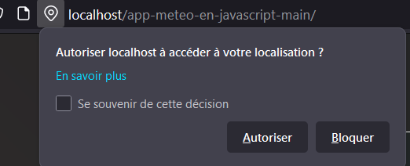
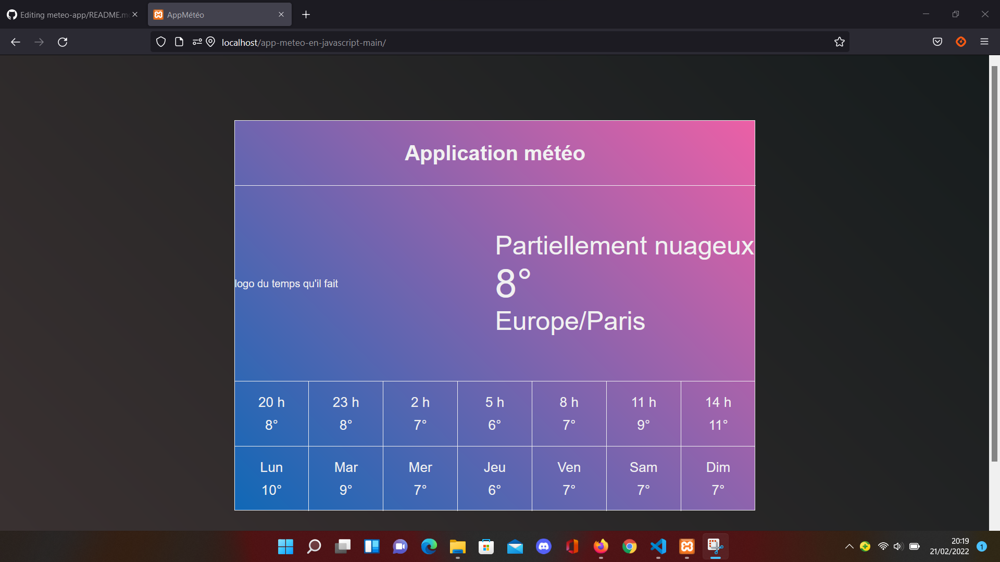

# meteo-app

MAHIEU Robin, FAUQUET Loïc, BULONE Benjamin
 
## Comment build et Start le container
```docker build -t docker-npm .```
<br/>
```docker run docker-npm```

## L'app Meteo
Lorsque nous arrivons sur la page, nous devons autoriser le partage de la position afin que l'application puisse nous donner la météo locale.
<br/>

<br/>
Une fois que nous avons autorisé la géolocalisation, voici la méteo sur une semaine.
<br/>

