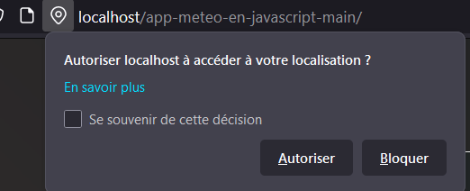

# meteo-app

MAHIEU Robin, FAUQUET Loïc, BULONE Benjamin
 
## Comment build et Start le container
```docker build -t docker-npm .```
```docker run docker-npm```

## L'app Meteo
Lorsque nosu arrivons sur la page nous devons autoriser le partage de la position, afin que l'application puisse nous donner la météo local.


